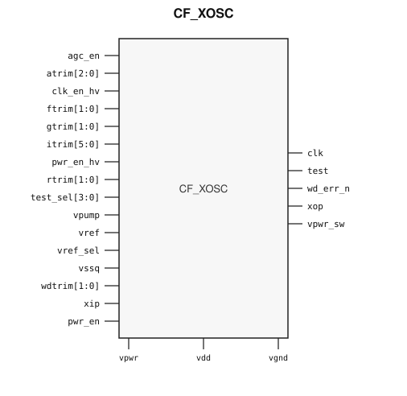

# CF_XOSC

> Crystal oscillator interface

The public GDS is an abstract; ChipFoundry
substitutes protected full geometry at tapeout.

This package ships an SRAM-style PG wrap `CF_XOSC` around analog leaf
`CF_XOSC_core`.

## Overview

`CF_XOSC` is a SkyWater 130 nm hard-macro crystal oscillator interface. Instantiate `CF_XOSC`.

Macro size is 338.285 × 344.98 µm (15 µm halo around analog leaf 308.285 × 314.98 µm).
Customer PG for chip PDN is `vpwr` / `vgnd`. Analog supplies `vdd`, `vpump`, and
`vssq` stay wrap ports and are routed as signals. `vpwr_sw` is a switched
supply output.

## Installation

```bash
pip install cf-ipm
ipm install CF_XOSC --version 0.2.0
```

Use `hdl/gl/CF_XOSC.v` as the customer blackbox, `layout/lef/CF_XOSC.lef`
for P&R, and `layout/gds/CF_XOSC.gds` / `layout/mag/CF_XOSC.mag` for the
public wrap. `CF_XOSC_core` is the analog leaf (empty Verilog, pin-only
abstract). ChipFoundry substitutes vault GDS into `CF_XOSC_core` at tapeout.
P&R uses the wrap LEF (`vpwr` / `vgnd` for chip PDN).

Functional sim compiles `verify/beh_model/CF_XOSC_core.v` **instead of** the empty `hdl/gl/CF_XOSC_core.v` stub. See `verify/beh_model/README.md`.

## Features

- Crystal pins `xip` and `xop`
- Clock output `clk`
- Power enable `pwr_en` and clock enable `clk_en_hv`
- Switched supply output `vpwr_sw`
- Reference `vref` and select `vref_sel`
- Analog supplies `vdd`, `vpump`, and quiet ground `vssq`
- Trim `atrim`, `ftrim`, `gtrim`, `itrim`, `rtrim`, `wdtrim`, and test `test_sel`
- Ideal Verilog behavioral model under `verify/beh_model/` for functional sim
- Customer cell `CF_XOSC` 338.285 × 344.98 µm (15 µm halo around analog leaf 308.285 × 314.98 µm)
- Chip PDN is `vpwr` / `vgnd`

## Pinout

Customer documentation includes a pinout of the integration cell only.
Internal schematics and architecture block diagrams are not published.



Pin names and directions match the public wrap (`layout/lef/CF_XOSC.lef`)
and the blackbox stub (`hdl/gl/CF_XOSC.v`).

## Pin Description

Directions and widths are taken from the shipped Verilog in `hdl/gl/CF_XOSC.v`.

| Name | Direction | Width | Description |
|---|---|---:|---|
| `clk` | output | 1 | Clock. Follows `xip` in the ideal model when enabled. |
| `test` | output | 1 | Test observe. Held low in the ideal model. |
| `wd_err_n` | output | 1 | Watchdog flag. High while `pwr_en` is high in the ideal model. |
| `xop` | output | 1 | Crystal output. Complement of `xip` while enabled; high-Z when `pwr_en` is low. |
| `agc_en` | input | 1 | Amplitude-control enable. Not modeled. |
| `atrim` | input | 3 | Amplitude trim. Not modeled. |
| `clk_en_hv` | input | 1 | Clock enable. Low holds `clk` low in the ideal model. |
| `ftrim` | input | 2 | Frequency trim. Not modeled. |
| `gtrim` | input | 2 | Gain trim. Not modeled. |
| `itrim` | input | 6 | Current trim. Not modeled. |
| `pwr_en_hv` | input | 1 | High-voltage power enable. Not modeled. |
| `rtrim` | input | 2 | Resistor trim. Not modeled. |
| `test_sel` | input | 4 | Test select. Not modeled. |
| `vpwr` | input | 1 | Digital supply. Tied to the core `vcc` pin inside the wrap. |
| `vdd` | input | 1 | Second supply. Route as a signal; not on chip PDN. |
| `vpump` | input | 1 | Pump supply. Route as a signal; not on chip PDN. |
| `vref` | input | 1 | Reference. Route as a signal; not on chip PDN. |
| `vref_sel` | input | 1 | Reference select. Not modeled. |
| `vgnd` | input | 1 | Ground. Tied to the core `vssd` pin inside the wrap. |
| `vssq` | input | 1 | Quiet ground. Route as a signal; not on chip PDN. |
| `wdtrim` | input | 2 | Watchdog trim. Not modeled. |
| `xip` | input | 1 | Crystal input. |
| `pwr_en` | input | 1 | Power enable. Low clears the outputs in the ideal model. |
| `vpwr_sw` | output | 1 | Switched supply. Follows `vpwr` while `pwr_en` is high; high-Z when `pwr_en` is low. |

The core `vcc` pin is tied to wrap `vpwr`, and the core `vssd` pin is tied to
wrap `vgnd`. Do not connect those core pins at chip level. The core `vpwr`
pin is the switched output `vpwr_sw`, not the chip PDN rail.

In OpenLane / LibreLane, hook chip PDN with
`PDN_MACRO_CONNECTIONS: "u_cf_xosc vccd1 vssd1 vpwr vgnd"` and connect
`.vpwr(vccd1)`, `.vgnd(vssd1)` under `USE_POWER_PINS`. Route `vdd`, `vpump`,
`vssq`, `vref`, `xip`, `xop`, and `vpwr_sw` onto `analog_io`.

```json
"SYNTH_ELABORATE_ONLY": true,
"SYNTH_USE_PG_PINS_DEFINES": "USE_POWER_PINS",
"FP_PDN_ENABLE_RAILS": false,
"RUN_TAP_ENDCAP_INSERTION": false,
"FP_PDN_HORIZONTAL_HALO": 10,
"FP_PDN_VERTICAL_HALO": 10,
"PDN_MACRO_CONNECTIONS": ["u_cf_xosc vccd1 vssd1 vpwr vgnd"],
"MAGIC_EXT_USE_GDS": false,
"MAGIC_EXT_ABSTRACT_CELLS": ["^CF_XOSC_core$"],
"PRIMARY_GDSII_STREAMOUT_TOOL": "magic",
"MAGIC_MACRO_STD_CELL_SOURCE": "macro",
"MAGIC_CAPTURE_ERRORS": false,
"RUN_MAGIC_DRC": false
```

## Specifications

This macro is the catalog crystal oscillator interface. No Liberty timing file
ships with this package. This README does not invent PVT tables. The ideal
model passes `xip` to `clk` when enabled. It does not implement a 4–33 MHz
resonator.

## Timing Diagram

The ideal model in `verify/beh_model/` is the functional timing reference for
simulation. `pwr_en` low clears `clk`, `test`, and `wd_err_n`, and releases
`xop` and `vpwr_sw`. With `pwr_en` and `clk_en_hv` high, `clk` follows `xip`
and `vpwr_sw` follows `vpwr`. That model is not silicon-verified.

## Limitations and Open Issues

- Verilog in `hdl/gl/CF_XOSC.v` is a structural wrap around an empty
  `CF_XOSC_core` blackbox. Functional sim uses `verify/beh_model/CF_XOSC_core.v` (ideal model, not SPICE).
- Liberty is not in this package. P&R uses the wrap LEF.
- Crystal startup, frequency trim, amplitude control, and the watchdog are not modeled.

## Release History

| Version | Date | Notes |
|---|---|---|
| 0.2.0 | 2026-09-29 | First SRAM-style PG-wrapped package. Ideal behavioral model. Core fill-exclude covers. |

## Tapeout History

This hard macro has high-volume commercial production history (millions of
units). Catalog and IPM maturity is Production. ChipFoundry substitutes
protected full layout at tapeout. The chipIgnite delivery of this package is
not marked shuttle-proven until a run returns.
